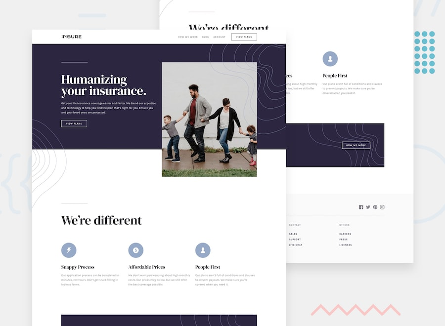

# Insure Landing Page

<div align="center">
  
  
  <h3>A modern, responsive insurance landing page built with vanilla HTML, CSS, and JavaScript</h3>

</div>


## 📖 Overview

Insure Landing Page is a modern, fully responsive website designed for an insurance company. This project demonstrates best practices in front-end development, including mobile-first design, semantic HTML, modern CSS techniques, and progressive enhancement with JavaScript.

### 🎯 The Challenge

The goal was to build a pixel-perfect landing page that matches the provided design specifications while ensuring:
- Responsive design across all device sizes
- Smooth animations and hover effects
- Accessible navigation and content
- Optimal performance and loading times

### 🌟 Key Highlights

- **Mobile-First Approach**: Designed and developed starting with mobile devices
- **Semantic HTML5**: Proper document structure and accessibility considerations
- **Modern CSS**: Flexbox, Grid, and custom properties implementation
- **Progressive Enhancement**: JavaScript features that enhance but don't break the basic functionality
- **Performance Optimized**: Compressed images and efficient CSS/JS

## ✨ Features

### Core Features
- 📱 **Fully Responsive Design** - Optimized for mobile, tablet, and desktop
- 🎨 **Modern UI/UX** - Clean, professional design following current trends
- 🚀 **Fast Loading** - Optimized assets and efficient code structure
- ♿ **Accessible** - WCAG 2.1 AA compliant with proper semantic markup
- 🎭 **Interactive Elements** - Smooth hover effects and animations

### Navigation Features
- 📱 **Mobile Navigation Menu** - Collapsible hamburger menu for mobile devices
- 🔄 **Smooth Transitions** - Animated menu toggles and state changes
- 🎯 **Focus Management** - Proper keyboard navigation support

### Visual Features
- 🎨 **Custom Animations** - Subtle micro-interactions for better UX
- 📐 **CSS Grid & Flexbox** - Modern layout techniques
- 🖼️ **Optimized Images** - Responsive images with proper sizing
- 🎪 **SVG Icons** - Scalable vector graphics for crisp visuals

## 🛠️ Tech Stack

### Frontend Technologies
- **HTML5** - Semantic markup and modern standards
- **CSS3** - Modern styling with custom properties and grid/flexbox
- **Vanilla JavaScript** - No frameworks, pure JavaScript for interactions
- **Google Fonts** - DM Serif Display and Karla font families

### Development Tools
- **Git** - Version control
- **VS Code** - Code editor with extensions
- **Browser DevTools** - Testing and debugging
- **Lighthouse** - Performance and accessibility auditing

### Design Resources
- **Frontend Mentor** - Design specifications and assets
- **Figma** - Design reference 
## 🚀 Getting Started

### Installation

1. **Clone the repository**
   ```bash
   git clone https://github.com/Ayokanmi-Adejola/insure-landing-page.git
   ```

2. **Navigate to the project directory**
   ```bash
   cd insure-landing-page
   ```

3. **Open with a local server**
   
   **Option A: Using VS Code Live Server Extension**
   - Install the Live Server extension in VS Code
   - Right-click on `index.html` and select "Open with Live Server"
   
   **Option B: Using Python **
   ```bash
   # Python 3
   python -m http.server 8000
   
   # Python 2
   python -m SimpleHTTPServer 8000
   ```
   
   **Option C: Using Node.js **
   ```bash
   npx http-server
   ```

4. **Open your browser**
   - Navigate to `http://localhost:8000` (or the port your server is using)
   - The landing page should now be visible

### Alternative Setup

If you don't want to use a local server, you can:
1. Simply double-click the `index.html` file
2. The page will open in your default browser
3. Note: Some features might not work correctly without a server

## 📱 Usage

### Navigation
- **Desktop**: Use the top navigation menu to access different sections
- **Mobile**: Tap the hamburger menu (☰) to reveal navigation options
- **Keyboard**: Use Tab to navigate, Enter/Space to activate buttons

### Interactive Elements
- **Buttons**: Hover effects reveal interactive states
- **Links**: Visual feedback on hover and focus
- **Mobile Menu**: Smooth slide-in animation

### Responsive Breakpoints
- **Mobile**: 375px - 767px
- **Tablet**: 768px - 1023px
- **Desktop**: 1024px and above

## 🎨 Design System

### Color Palette

#### Primary Colors
- **Blue 950**: `hsl(256, 26%, 20%)` - Main dark blue
- **Blue 500**: `hsl(216, 30%, 68%)` - Light blue accent

#### Neutral Colors
- **Gray 950**: `hsl(270, 9%, 17%)` - Very dark text
- **Gray 700**: `hsl(273, 4%, 51%)` - Medium gray
- **Gray 50**: `hsl(0, 0%, 98%)` - Very light background

### Typography

#### Font Families
- **Primary**: 'DM Serif Display' - Headings and display text
- **Secondary**: 'Karla' - Body text and UI elements

#### Font Weights
- **Regular**: 400
- **Bold**: 700

#### Font Sizes
- **Base**: 16px
- **Responsive scaling** using clamp() for fluid typography

### Spacing System
- **Base Unit**: 1rem (16px)
- **Scale**: 0.5rem, 1rem, 1.5rem, 2rem, 3rem, 4rem, 6rem

## 🏗️ Project Structure

```
insure-landing-page/
├── 📁 design/                 # Design reference files
│   ├── active-states.jpg
│   ├── desktop-design.jpg
│   ├── mobile-design.jpg
│   └── mobile-nav-design.jpg
├── 📁 images/                 # Optimized assets
│   ├── 🎨 bg-patterns/        # Background patterns
│   ├── 🏷️ icons/             # SVG icons
│   ├── 📷 photos/             # Hero images
│   └── favicon-32x32.png
├── 📄 index.html              # Main HTML structure
├── 🎨 styles.css              # All styling (mobile-first)
├── ⚡ script.js               # JavaScript interactions
├── 📋 style-guide.md          # Design specifications
├── 🖼️ preview.jpg            # Project preview image
├── 📖 README.md               # Project documentation
└── 📝 README-template.md      # Frontend Mentor template
```

### File Organization

#### HTML Structure
- Semantic HTML5 elements
- Proper heading hierarchy (h1-h6)
- Accessible form elements and ARIA labels
- Optimized meta tags for SEO

#### CSS Organization
- Mobile-first responsive design
- Custom CSS properties (variables)
- Logical property grouping
- BEM naming convention for classes

#### JavaScript Functionality
- Mobile navigation toggle
- Smooth scrolling (if implemented)
- Form validation (if applicable)

## 🧪 Testing

### Manual Testing Checklist

#### Responsive Design
- [ ] Mobile (320px - 767px)
- [ ] Tablet (768px - 1023px)
- [ ] Desktop (1024px+)
- [ ] Large screens (1440px+)

#### Browser Testing
- [ ] Chrome (latest)
- [ ] Firefox (latest)
- [ ] Safari (latest)
- [ ] Edge (latest)
- [ ] Mobile browsers (iOS Safari, Chrome Mobile)

#### Accessibility Testing
- [ ] Keyboard navigation
- [ ] Screen reader compatibility
- [ ] Color contrast ratios
- [ ] Focus indicators
- [ ] ARIA labels and roles

#### Performance Testing
- [ ] Lighthouse audit (90+ score target)
- [ ] Image optimization
- [ ] CSS/JS minification
- [ ] Loading speed on slow connections

### Automated Testing Tools
- **Lighthouse** - Performance, accessibility, SEO audits
- **WAVE** - Web accessibility evaluation
- **GTmetrix** - Page speed analysis
- **BrowserStack** - Cross-browser testing


## 📊 Performance

### Optimization Strategies

#### Images
- **Format**: WebP with JPG fallback
- **Compression**: 80-85% quality for photos
- **Responsive**: Multiple sizes using srcset
- **Lazy Loading**: For below-the-fold images

#### CSS
- **Critical CSS**: Inline above-the-fold styles
- **Unused CSS**: Remove unused styles
- **Minification**: Compress CSS files
- **CSS Variables**: Efficient theming

#### JavaScript
- **Minimal Dependencies**: Vanilla JS approach
- **Event Delegation**: Efficient event handling
- **Lazy Loading**: Load features when needed
- **Minification**: Compress JavaScript files

### Performance Metrics
- **First Contentful Paint**: < 1.5s
- **Largest Contentful Paint**: < 2.5s
- **Cumulative Layout Shift**: < 0.1
- **First Input Delay**: < 100ms

## ♿ Accessibility

### WCAG 2.1 AA Compliance

#### Keyboard Navigation
- All interactive elements accessible via keyboard
- Logical tab order throughout the page
- Visible focus indicators
- Skip links for main content

#### Screen Reader Support
- Semantic HTML structure
- Proper heading hierarchy
- Alt text for all images
- ARIA labels where needed

#### Color and Contrast
- Minimum contrast ratio of 4.5:1 for normal text
- Minimum contrast ratio of 3:1 for large text
- Information not conveyed by color alone

#### Responsive Design
- Text scales up to 200% without horizontal scrolling
- Content reflows properly on different screen sizes
- Touch targets minimum 44px × 44px

### Accessibility Testing
- **axe DevTools** - Automated accessibility testing
- **NVDA/JAWS** - Screen reader testing
- **Keyboard Only** - Navigation without mouse
- **Color Oracle** - Color blindness simulation

## 📱 Browser Support

### Fully Supported
- Chrome 88+
- Firefox 85+
- Safari 14+
- Edge 88+

### Partially Supported
- Internet Explorer 11 (basic functionality only)
- Older mobile browsers (graceful degradation)

### Progressive Enhancement
- Core functionality works on all browsers
- Enhanced features for modern browsers
- Graceful fallbacks for older browsers

## 🔧 Configuration

### Customization Options

#### Colors
Update CSS custom properties in `:root`:
```css
:root {
  --color-primary: hsl(256, 26%, 20%);
  --color-secondary: hsl(216, 30%, 68%);
  /* Add your custom colors */
}
```

#### Fonts
Replace Google Fonts links in HTML:
```html
<link href="https://fonts.googleapis.com/css2?family=YourFont:wght@400;700&display=swap" rel="stylesheet">
```

#### Layout
Modify breakpoints in CSS:
```css
@media (min-width: 768px) {
  /* Tablet styles */
}

@media (min-width: 1024px) {
  /* Desktop styles */
}
```


## ❓ FAQ

### General Questions

**Q: Is this a real insurance website?**
A: No, this is a practice project based on a Frontend Mentor design challenge. It's for educational and portfolio purposes only.


**Q: Do I need to know JavaScript to understand this project?**
A: Basic JavaScript knowledge is helpful, but the project uses vanilla JS with clear comments. HTML and CSS knowledge is more important.


## 🐛 Known Issues

### Current Issues

#### Minor Issues
- **IE11 Flexbox**: Some flexbox properties may not work perfectly in Internet Explorer 11
- **Mobile Safari**: Slight differences in font rendering on iOS devices
- **Focus Styles**: Some browsers may show default focus styles alongside custom ones

#### Workarounds
- **IE11**: Consider using Flexbox fallbacks or CSS Grid alternatives
- **Safari**: Test on actual devices for font consistency
- **Focus**: Use `:focus-visible` pseudo-class for better control

## 🙏 Acknowledgments

### Design Credits
- **Frontend Mentor** - For providing the design challenge and assets
- **Design Team** - Original design concept and specifications

### Code Inspiration
- **Kevin Powell** - CSS techniques and responsive design patterns
- **Wes Bos** - JavaScript best practices and modern development approaches
- **MDN Web Docs** - Comprehensive web development documentation

### Tools and Resources
- **Google Fonts** - Typography resources
- **Unsplash** - High-quality images
- **Feather Icons** - Beautiful open-source icons
- **CSS-Tricks** - Web development techniques and tutorials# Insure-Landing-page

